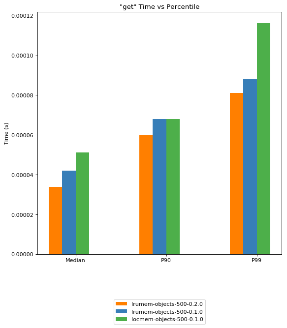

django-lrucache-backend
=======================

.. image:: https://img.shields.io/pypi/v/django-lrucache-backend.svg
    :target: https://pypi.python.org/pypi/django-lrucache-backend
    :alt: Latest PyPI version

.. image:: https://travis-ci.org/kogan/django-lrucache-backend.svg?branch=master
   :target: https://travis-ci.org/kogan/django-lrucache-backend
   :alt: Latest Travis CI build status

A smarter local memory cache backend for Django.

`Set Performance <benchmarking/0.2.0/objects-set.png>`_. `Delete performance
<benchmarking/0.2.0/objects-delete.png>`_.

About
-----

`lrucache_backend` is an in-memory cache that improves upon the existing
`LocMemCache` that Django provides.

Comes with cache timeouts and a smart eviction strategy that prefers to keep
keys that are used often and evict keys that are not.

Originally developed to avoid poorly reimplementing local object stores for
service layer objects. For example:

.. code-block:: python

    def get_data_before(self):
        if not hasattr(self, '__data'):
            self.__data = self.expensive_query()
        return self.__data

    def get_data_after(self):
        lcache = caches['local']
        data = lcache.get('our_data')
        if not data:
            data = self.expensive_query()
            lcache.set('our_data', data, timeout=600)
        return data

The benefits (despite the longer method) include timeouts, sharing data between
requests, and avoiding network requests. This is especially useful when there
are hundreds or thousands of property accesses that would hit the cache where
network overhead would be prohibitive. The `Fat model` pattern can greatly
benefit from tiered caching.

Good for?
^^^^^^^^^

An in memory cache is good for small data that changes rarely. It's effectively
a global dictionary shared between requests in the same process. Small lookup
tables and database backed settings are good candidates.

A small number of keys should be used to avoid engaging the culling strategy
of the cache. Performance goes down fast as soon as the maximum number of keys
are reached, and keys start to evict.

This should **not** be used as your primary cache, but it makes for an
excellent secondary cache when you want to avoid the overhead of a network call.

Use for:

- Small lookup tables
- Settings
- Backing store for your service objects
- Remembering values for the duration of a request or celery task
- Small global template fragments like sidebars or footers
- Secondary cache

Bad for?
^^^^^^^^

An in memory cache is terrible for data that changes often. Because the cache
is process local, it's extremely difficult to coordinate cache invalidation
from external processes. For that reason, this library does nothing to support
cache invalidation.

The cache shares memory with the application, so it's extremely important to
avoid storing a lot of keys, or any large values.

Do **not** use for:

- Instance attributes/properties
- Full templates
- Tables with a large number of rows
- Large values
- Large lists
- Primary cache

Differences from LocMemCache
^^^^^^^^^^^^^^^^^^^^^^^^^^^^

- Avoids pickling
- Avoids key name validation
- Uses an LRU eviction algorithm rather than a random percentage culling strategy

Installation
------------

.. code-block:: bash

     pip install django-lrucache-backend

Requirements
^^^^^^^^^^^^

* `lru-dict <https://pypi.python.org/pypi/lru-dict/>`_.

`lru-dict` is implemented in C and is unlikely to work with non-CPython
implementations. There *are* compatible pure python libraries. If you need this
ability, please open an Issue!

Usage
-----

Configure your `CACHES` Django setting appropriately:

.. code-block:: python

    CACHES = {
        'local': {
            'BACKEND': 'lrucache_backend.LRUObjectCache',
            'TIMEOUT': 600,
            'OPTIONS': {
                'MAX_ENTRIES': 100
            },
            'NAME': 'optional-name'
        }
    }

And then use the cache as you would any other:

.. code-block:: python

    >>> from django.core.cache import caches

    >>> local = caches['local']
    >>> local.set('key', 123)
    >>> local.get('key')
    ... 123

If you're going to use this cache backend, then it's highly recommended to use
it as a non-default cache. That is, do not configure this cache under the
`default` name.

Local memory caches compete for memory with your application so it's in your
best interests to use it as sparingly and deliberately as possible.

Compatibility
-------------

Django 1.8 - Django master. All Python versions supported by compatible Django
versions.

Licence
-------

MIT

Authors
-------

`django-lrucache-backend` was written by `Josh Smeaton <josh.smeaton@gmail.com>`_.
